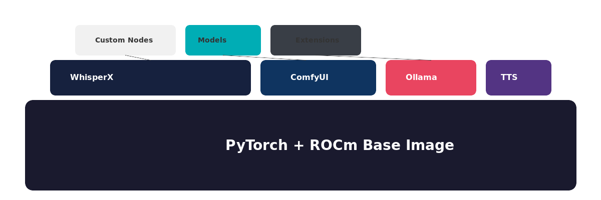

# AMD AI Notes

A small notebook intended for those who own AMD GPUs and are trying to get things working (like local LLMs, Comfy UI, and more) while minimising the amount of hair removed from their scalp.

The amount of hair that I have extracted from my scalp has been declining for some years. For this I thank:

- Claude and ChatGPT
- Reddit

---

## Index

### Speech
- [ASR & Whisper](speech/asr-and-whisper.md) - Speech-to-text, Whisper models, ROCm vs Vulkan
- [Text-to-Speech](speech/tts.md) - TTS models on AMD

### Large Language Models
- [Local LLMs](llms/local-llms.md) - Ollama, LM Studio, and running LLMs locally

### Image Generation
- [ComfyUI](image-generation/comfyui.md) - Node-based image generation
- [InvokeAI](image-generation/invokeai.md) - Stable Diffusion UI
- [Image-to-Video](image-generation/image-to-video.md) - Video generation from images

---

## About Me

Just a regular guy (ok, somewhat regular) who bought a workstation with an AMD GPU before getting "into" AI and local AI.

As much as trying to work around NVIDIA-centric apps drives me crazy, I've found that with perseverence you can usually find solutions.

If I had a money tree in my garden, I would probably go out and buy an Nvidia GPU tomorrow. However, I also quite like working with AMD. Their more affordable GPUs are not to be sniffed at. Therefore I persevere.

## Reference System

The notes in this repository were validated on the following system:

| Component | Specification |
|-----------|---------------|
| **GPU** | AMD Radeon RX 7700 XT (Navi 32, gfx1101) |
| **CPU** | Intel Core i7-12700F (12th Gen) |
| **RAM** | 64 GB |
| **ROCm** | 6.3.0 |
| **OS** | Ubuntu (Linux) |

If you have similar hardware, the configurations and workarounds described here should work for you. Your mileage may vary with different GPU generations (especially different gfx versions).

## Core Approach

The core approach that I have come to favor and describe in these notes is a layering approach using Docker (this can also be achieved using Conda ).

Essentially it entails:

- ROCM and Pytroch is the foundation. If you are not constrained by storage space, you can keep several of these with different versions of Python. If you are more storage constrained then you can create just one verified base image.  
- Upon this foundation build stacks that layer the dependencies for the individual services on top of that stable core. Sometimes this works without great effort. In other cases, a little bit of tweaking is required in order to get the additional services to work with the Python version in your base. If you want to avoid that work, this is why having several stable course can be advantageous. 

## Key Takeaways

- **Vulkan** is often easier than ROCm for audio/speech workloads
- **`HSA_OVERRIDE_GFX_VERSION`** is your friend for newer AMD GPUs
- **Ollama** just works for local LLMs
- Many tools need PyTorch ROCm wheels - check your torch installation with `torch.cuda.is_available()` (yes, it returns True for ROCm too)
